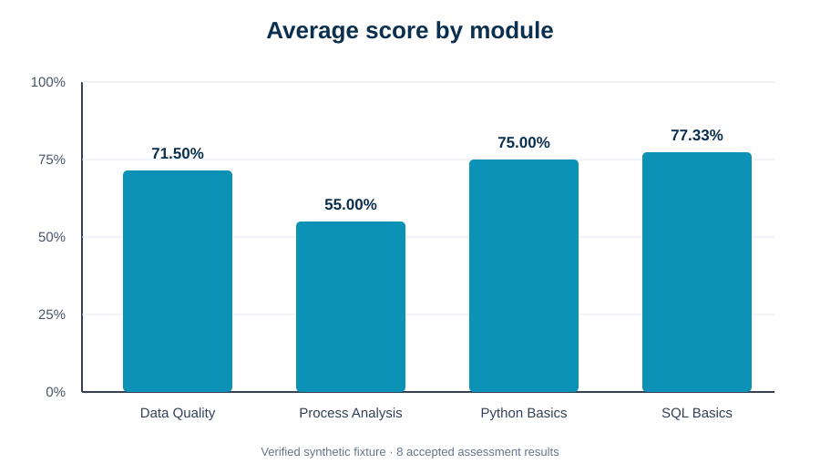
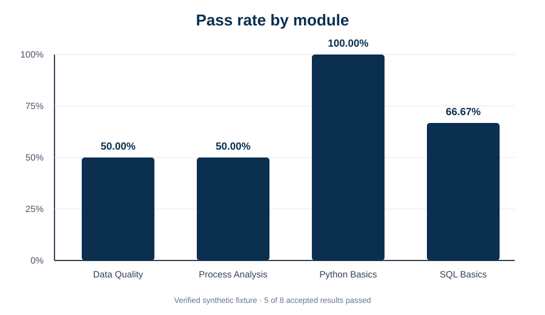

# Python Data Basics

[](https://github.com/DataTideHH/python-data-basics/actions/workflows/python-quality.yml)

**Python 3.12 · pandas · data quality · reporting · matplotlib · pytest · Ruff · Jupyter · GitHub Actions**

This repository is a compact, tested foundation for reproducible Python Data/BI workflows. It combines environment setup, deterministic pandas transformations, an auditable data-quality workflow, reconciled reporting outputs, clean notebooks and cross-platform CI.

It is part of my DataTideHH portfolio during the IHK retraining program in Data and Process Analysis. The scope remains deliberately bounded: this is a reusable learning and verification baseline, not a production ETL platform, predictive-model showcase or enterprise reporting solution.

---

## Project at a Glance

| Area | Current implementation |
|---|---|
| Python baseline | Python 3.12-compatible environment and deterministic pandas sanity check |
| Dependency model | Runtime, notebook, optional ML and development groups in `pyproject.toml` |
| Data-quality workflow | CSV input, schema checks, controlled conversion, rejection reasons, cleaning, KPIs and export |
| Reporting workflow | KPI reconciliation, rejection-reason summary, control totals and Matplotlib SVG charts |
| Notebook verification | Clean reporting notebook with tables, charts and explicit assertions |
| Testing | pytest coverage for baseline logic, quality rules, reporting reconciliation and notebook hygiene |
| Code quality | Ruff linting and formatting plus Python bytecode compilation |
| Continuous integration | Complete Ubuntu 24.04 and Windows 2025 matrix with Python 3.12 |
| Credential safety | Synthetic/public-safe inputs; local environments, secrets and generated outputs excluded |

## End-to-End Flow

```text
data/raw/training_results.csv
        │
        ▼
data-quality validation and cleaning
        │
        ├── cleaned_results.csv
        ├── rejected_results.csv
        ├── module_kpis.csv
        └── quality_report.json
        │
        ▼
reporting reconciliation and presentation
        │
        ├── rejection_reason_summary.csv
        ├── reporting_summary.json
        ├── average_score_by_module.svg
        └── pass_rate_by_module.svg
        │
        ▼
clean reporting notebook with repeated control assertions
```

The reporting layer does not trust a persisted KPI file blindly. It recalculates module KPIs from the cleaned records and fails when values differ.

---

## Quick Start

Detailed platform instructions are in [`docs/setup.md`](docs/setup.md).

### Windows PowerShell

```powershell
py -3.12 -m venv .venv
& ".\.venv\Scripts\Activate.ps1"
python -m pip install --upgrade pip
python -m pip install -r requirements-dev.txt
python main.py
```

### macOS and Linux

```bash
python3.12 -m venv .venv
source .venv/bin/activate
python -m pip install --upgrade pip
python -m pip install -r requirements-dev.txt
python main.py
```

On the Intel iMac used for local portfolio work, Python 3.12 is available at `/usr/local/bin/python3.12`.

---

## Data-Quality Workflow

The tested workflow in [`data_quality/`](data_quality/) processes:

```text
data/raw/training_results.csv
```

### Run on Windows PowerShell

```powershell
python -m data_quality `
  --input "data/raw/training_results.csv" `
  --output ".ci-output/data-quality"
```

### Run on macOS or Linux

```bash
python -m data_quality \
  --input data/raw/training_results.csv \
  --output .ci-output/data-quality
```

### Generated files

```text
.ci-output/data-quality/
├── cleaned_results.csv
├── rejected_results.csv
├── module_kpis.csv
└── quality_report.json
```

### Implemented validation rules

- required-column validation
- missing-value detection
- strict ISO date parsing
- controlled numeric conversion
- positive `max_score`
- non-negative score and pass threshold
- score not above maximum
- pass threshold not above maximum
- exact duplicate removal
- conflicting duplicate rejection
- identifier and whitespace normalisation

Invalid rows are not silently discarded. They remain auditable in `rejected_results.csv` with explicit pipe-separated reason codes.

Accepted records receive:

- `source_row` for lineage to the raw CSV
- `score_percentage`
- non-null Boolean `passed`

The committed fixture contains 15 raw rows and produces:

```text
accepted rows:               8
rejected rows:               7
exact duplicate rows removed: 1
```

Detailed rules and boundaries are documented in [`docs/data-quality-workflow.md`](docs/data-quality-workflow.md).

---

## Reporting Workflow

Run reporting after the data-quality output exists.

### Windows PowerShell

```powershell
python -m reporting `
  --input ".ci-output/data-quality" `
  --output ".ci-output/reporting"
```

### macOS and Linux

```bash
python -m reporting \
  --input .ci-output/data-quality \
  --output .ci-output/reporting
```

### Generated files

```text
.ci-output/reporting/
├── average_score_by_module.svg
├── pass_rate_by_module.svg
├── rejection_reason_summary.csv
└── reporting_summary.json
```

### Verified control totals

| Control | Expected value |
|---|---:|
| Modules | 4 |
| Accepted results | 8 |
| Rejected rows | 7 |
| Overall average score | 70.00% |
| Overall pass rate | 62.50% |
| Distinct rejection reasons | 7 |
| KPI reconciliation | passed |

The reporting workflow stops with a non-zero exit code when an expected input file is missing, a required column is absent or persisted module KPIs differ from the fresh calculation.

Detailed behaviour is documented in [`docs/reporting-notebook.md`](docs/reporting-notebook.md).

---

## Verified Reference Charts

The repository includes compact SVG snapshots for the committed synthetic fixture. The CI workflow generates fresh Matplotlib SVG files from the current outputs on every run.

### Average score



### Pass rate



These charts are descriptive controls for a small synthetic dataset, not statistical evidence about real learners or business operations.

---

## Reporting Notebook

[`notebooks/reporting_verification.ipynb`](notebooks/reporting_verification.ipynb) reads the generated data-quality outputs and performs the same reporting checks through the reusable package.

It contains:

1. verified module KPI table
2. rejection-reason summary
3. average-score chart
4. pass-rate chart
5. explicit assertions for the expected control totals
6. final `Reporting notebook verification passed.` marker

The committed notebook contains no outputs, execution counts, local paths or IDE timestamps. GitHub Actions executes a temporary copy only after the data-quality and reporting command-line workflows succeed.

[`dataspell_test.ipynb`](dataspell_test.ipynb) remains the smaller environment and import check.

---

## Baseline Entry Point

[`main.py`](main.py) is a separate deterministic environment and pandas sanity check. It reports the active interpreter and direct runtime package versions, validates a tiny DataFrame and calculates a stable category summary.

This separates environment verification from the row-level data-quality and reporting workflows.

---

## Additional Example Modules

- [`examples/01_csv_pandas_basics.py`](examples/01_csv_pandas_basics.py) — CSV and grouped pandas operations
- [`examples/02_json_basics.py`](examples/02_json_basics.py) — nested JSON normalisation
- [`examples/03_api_request_basics.py`](examples/03_api_request_basics.py) — public Open-Meteo request without credentials
- [`examples/04_ollama_local_api_basics.py`](examples/04_ollama_local_api_basics.py) — optional localhost-only JSON request
- [`examples/optional/logistic_regression_basics.py`](examples/optional/logistic_regression_basics.py) — bounded scikit-learn API example without a model-quality claim

---

## Dependency Model

`pyproject.toml` is the source of truth.

| Installation | Included scope |
|---|---|
| `python -m pip install -e .` | Runtime baseline, data quality and reporting |
| `python -m pip install -e ".[notebook]"` | Runtime plus Jupyter |
| `python -m pip install -e ".[ml]"` | Runtime plus optional scikit-learn example |
| `python -m pip install -e ".[dev]"` | Runtime plus pytest and Ruff |
| `python -m pip install -r requirements-dev.txt` | Complete CI-equivalent environment |

Installed command-line entry points:

```text
python-data-quality
python-data-reporting
```

The requirement files remain small wrappers rather than machine-specific freezes of every transitive package.

---

## Local Quality Checks

```bash
python -m compileall -q main.py data_quality reporting examples tests
python -m ruff check main.py data_quality reporting examples tests
python -m ruff format --check main.py data_quality reporting examples tests
python -m pytest
python main.py
python -m data_quality --input data/raw/training_results.csv --output .ci-output/data-quality
python -m reporting --input .ci-output/data-quality --output .ci-output/reporting
python examples/optional/logistic_regression_basics.py
```

Execute the notebooks separately:

```bash
jupyter nbconvert --to notebook --execute dataspell_test.ipynb --output environment-check.executed.ipynb --output-dir .ci-output --ExecutePreprocessor.timeout=120
jupyter nbconvert --to notebook --execute notebooks/reporting_verification.ipynb --output reporting-verification.executed.ipynb --output-dir .ci-output --ExecutePreprocessor.timeout=120
```

---

## Continuous Integration

The workflow in [`.github/workflows/python-quality.yml`](.github/workflows/python-quality.yml) runs on:

- Ubuntu 24.04
- Windows 2025
- Python 3.12

Each matrix job:

1. installs the project and optional quality groups
2. compiles Python sources
3. runs Ruff lint and format checks
4. runs the complete pytest suite
5. executes `main.py`
6. executes the full data-quality workflow
7. verifies the 15/8/7 source control totals
8. executes the reporting workflow
9. verifies KPI reconciliation and reporting totals
10. executes the optional ML example
11. executes both clean notebooks
12. uploads short-lived verified data, reporting, chart and notebook artefacts
13. enforces the final quality gate

The workflow is quality assurance, not deployment or release automation.

---

## Repository Structure

```text
python-data-basics/
├── .github/workflows/python-quality.yml
├── data/raw/training_results.csv
├── data_quality/
│   ├── __init__.py
│   ├── __main__.py
│   └── workflow.py
├── reporting/
│   ├── __init__.py
│   ├── __main__.py
│   └── workflow.py
├── notebooks/
│   └── reporting_verification.ipynb
├── docs/
│   ├── assets/
│   │   ├── average-score-by-module.svg
│   │   └── pass-rate-by-module.svg
│   ├── data-quality-workflow.md
│   ├── reporting-notebook.md
│   └── setup.md
├── examples/
├── tests/
│   ├── test_data_quality_workflow.py
│   ├── test_main.py
│   ├── test_notebook_hygiene.py
│   ├── test_optional_ml.py
│   └── test_reporting_workflow.py
├── dataspell_test.ipynb
├── main.py
├── pyproject.toml
├── requirements.txt
├── requirements-dev.txt
└── README.md
```

---

## Data and Credential Safety

Only synthetic learning data and public endpoints belong in this repository. The committed training-results file contains no real learners or personal information.

Excluded content includes local environments, `.env` files, API keys, OAuth tokens, credential downloads, personal/customer data, IDE metadata, caches, executed notebooks and generated workflow outputs.

---

## Current Boundaries

This repository does not claim:

- a production Python package, ETL platform or semantic model
- streaming or distributed processing
- production orchestration, observability or publication
- regulatory data validation
- a validated predictive model
- an interactive dashboard or Power BI report
- statistical inference from the synthetic fixture
- deployment or cloud infrastructure

The complete workflow remains small enough to inspect, run, test and explain in an interview or technical review.
